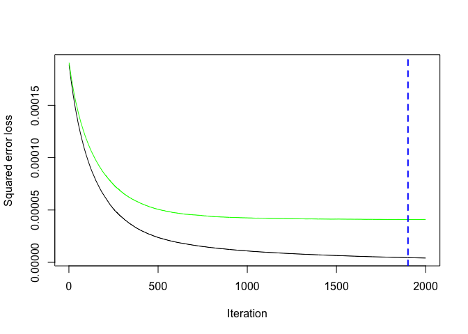

Hydrocarbon Analysis
================

-   <a href="#introduction" id="toc-introduction">Introduction</a>
-   <a href="#exploratory-analysis-of-the-data"
    id="toc-exploratory-analysis-of-the-data">Exploratory analysis of the
    data</a>
    -   <a href="#structure" id="toc-structure">Structure</a>
    -   <a href="#analysis" id="toc-analysis">Analysis</a>
        -   <a href="#summary-statistics" id="toc-summary-statistics">Summary
            statistics</a>
        -   <a href="#distribution-plots" id="toc-distribution-plots">Distribution
            plots</a>
    -   <a href="#correlation-matrix" id="toc-correlation-matrix">Correlation
        Matrix</a>
    -   <a href="#prepare-training-and-test-data-sets"
        id="toc-prepare-training-and-test-data-sets">Prepare Training And Test
        data sets</a>
    -   <a href="#regularisation-methods"
        id="toc-regularisation-methods">Regularisation Methods</a>
        -   <a href="#elastic-net-regression"
            id="toc-elastic-net-regression">Elastic Net Regression</a>
        -   <a href="#lasso-regression" id="toc-lasso-regression">Lasso
            Regression</a>
    -   <a href="#random-forest" id="toc-random-forest">Random Forest</a>
    -   <a href="#gradient-boosting-machines-gbms"
        id="toc-gradient-boosting-machines-gbms">Gradient Boosting Machines
        (GBMs)</a>
    -   <a href="#partial-least-squares-regressionpls"
        id="toc-partial-least-squares-regressionpls">Partial Least Squares
        Regression(PLS)</a>
-   <a href="#final-results" id="toc-final-results">Final Results</a>

# Introduction

This study takes a data-driven approach to explore the degree to which
the reactor calibration settings and composition of the feed hydrocarbon
mixed influence the yield of hydrocarbon in a target range of densities.

Hydrocarbons are chemical compounds with molecules consisting of
hydrogen and carbon atoms. Hydrocracking is an industrial process in
which hydrocarbons with molecules made of long chains of atoms are
broken down into smaller molecules. This is done by the addition of
hydrogen at high pressures and temperatures in the presence of a
chemical catalyst. This process is used in the petrochemical industry to
increase the proportion of extracted hydrocarbons that have shorter
molecules, which are typically more useful to consumers and attract a
higher profit on sale.

The process of hydrocracking can be controlled by adjusting the
temperature of the reactor (or equivalently its pressure), the catalyst
that is used and the time for which the hydrocarbon mixture is within
the reactor. The composition of the effluent hydrocarbon mixture will
depend on these settings of the reactor and on the composition of the
feed hydrocarbon mixture that entered the reactor. The most useful and
valuable hydrocarbons are not the heaviest (most dense, with longest
molecules) or the lightest (least dense, with smallest molecules), but
those within a density in a specific, intermediate range. This is known
as the target range.

This study uses a qualitative and quantitative approach to assess which
of their control variables are most influential on the yield of
hydrocarbon in the target range of densities. We will also predict the
yield in this range for a given feed composition and reactor
calibration. This would allow to not only maximise profits, but to
minimise waste by calibrating reactor output to meet but not exceed
demand.

# Exploratory analysis of the data

## Structure

The data contains observations for 497 days of 44 variables, which
detail the reactor settings and feed composition.In particular:

-   Date: Dates from 15/10/2020 to 23/02/2022.
-   Catalyst: Which of 3 catalysts were used. Can be 0,1 or 2.
-   Temperature: Reactor temperature in degrees Fahrenheit.
-   Through time: Reactor residence time of the mixture in hours.
-   feed fraction:Composition of the feed hydrocarbon mixtures as the
    proportion of the overall mass in each of 20 density intervals.
-   out fraction:Composition of the effluent hydrocarbon mixtures as the
    proportion of the overall mass in each of 20 density intervals

``` r
# Load data --------------------------------------------------------------------
hydro<- read_csv("data.csv") 
```

    ## Rows: 497 Columns: 44

    ## ── Column specification ────────────────────────────────────────────────────────
    ## Delimiter: ","
    ## dbl  (43): catalyst, temperature, through_time, feed_fraction_1, feed_fracti...
    ## date  (1): date

    ## 
    ## ℹ Use `spec()` to retrieve the full column specification for this data.
    ## ℹ Specify the column types or set `show_col_types = FALSE` to quiet this message.

``` r
head(hydro,5)  %>% knitr::kable("html") 
```

<table>
<thead>
<tr>
<th style="text-align:left;">
date
</th>
<th style="text-align:right;">
catalyst
</th>
<th style="text-align:right;">
temperature
</th>
<th style="text-align:right;">
through_time
</th>
<th style="text-align:right;">
feed_fraction_1
</th>
<th style="text-align:right;">
feed_fraction_2
</th>
<th style="text-align:right;">
feed_fraction_3
</th>
<th style="text-align:right;">
feed_fraction_4
</th>
<th style="text-align:right;">
feed_fraction_5
</th>
<th style="text-align:right;">
feed_fraction_6
</th>
<th style="text-align:right;">
feed_fraction_7
</th>
<th style="text-align:right;">
feed_fraction_8
</th>
<th style="text-align:right;">
feed_fraction_9
</th>
<th style="text-align:right;">
feed_fraction_10
</th>
<th style="text-align:right;">
feed_fraction_11
</th>
<th style="text-align:right;">
feed_fraction_12
</th>
<th style="text-align:right;">
feed_fraction_13
</th>
<th style="text-align:right;">
feed_fraction_14
</th>
<th style="text-align:right;">
feed_fraction_15
</th>
<th style="text-align:right;">
feed_fraction_16
</th>
<th style="text-align:right;">
feed_fraction_17
</th>
<th style="text-align:right;">
feed_fraction_18
</th>
<th style="text-align:right;">
feed_fraction_19
</th>
<th style="text-align:right;">
feed_fraction_20
</th>
<th style="text-align:right;">
out_fraction_1
</th>
<th style="text-align:right;">
out_fraction_2
</th>
<th style="text-align:right;">
out_fraction_3
</th>
<th style="text-align:right;">
out_fraction_4
</th>
<th style="text-align:right;">
out_fraction_5
</th>
<th style="text-align:right;">
out_fraction_6
</th>
<th style="text-align:right;">
out_fraction_7
</th>
<th style="text-align:right;">
out_fraction_8
</th>
<th style="text-align:right;">
out_fraction_9
</th>
<th style="text-align:right;">
out_fraction_10
</th>
<th style="text-align:right;">
out_fraction_11
</th>
<th style="text-align:right;">
out_fraction_12
</th>
<th style="text-align:right;">
out_fraction_13
</th>
<th style="text-align:right;">
out_fraction_14
</th>
<th style="text-align:right;">
out_fraction_15
</th>
<th style="text-align:right;">
out_fraction_16
</th>
<th style="text-align:right;">
out_fraction_17
</th>
<th style="text-align:right;">
out_fraction_18
</th>
<th style="text-align:right;">
out_fraction_19
</th>
<th style="text-align:right;">
out_fraction_20
</th>
</tr>
</thead>
<tbody>
<tr>
<td style="text-align:left;">
2020-10-15
</td>
<td style="text-align:right;">
2
</td>
<td style="text-align:right;">
430.4965
</td>
<td style="text-align:right;">
14.4852
</td>
<td style="text-align:right;">
0.1665249
</td>
<td style="text-align:right;">
0.1067418
</td>
<td style="text-align:right;">
0.1445298
</td>
<td style="text-align:right;">
0.0996205
</td>
<td style="text-align:right;">
0.0618106
</td>
<td style="text-align:right;">
0.0740259
</td>
<td style="text-align:right;">
0.0806809
</td>
<td style="text-align:right;">
0.0379410
</td>
<td style="text-align:right;">
0.0398031
</td>
<td style="text-align:right;">
0.0426279
</td>
<td style="text-align:right;">
0.0176451
</td>
<td style="text-align:right;">
0.0113143
</td>
<td style="text-align:right;">
0.0398534
</td>
<td style="text-align:right;">
0.0180133
</td>
<td style="text-align:right;">
0.0131453
</td>
<td style="text-align:right;">
0.0093708
</td>
<td style="text-align:right;">
0.0148047
</td>
<td style="text-align:right;">
0.0143313
</td>
<td style="text-align:right;">
0.0037179
</td>
<td style="text-align:right;">
0.0034976
</td>
<td style="text-align:right;">
0.0469721
</td>
<td style="text-align:right;">
0.0699713
</td>
<td style="text-align:right;">
0.1127505
</td>
<td style="text-align:right;">
0.1045085
</td>
<td style="text-align:right;">
0.1006671
</td>
<td style="text-align:right;">
0.1086029
</td>
<td style="text-align:right;">
0.0802410
</td>
<td style="text-align:right;">
0.0799082
</td>
<td style="text-align:right;">
0.0443304
</td>
<td style="text-align:right;">
0.0498234
</td>
<td style="text-align:right;">
0.0316218
</td>
<td style="text-align:right;">
0.0387775
</td>
<td style="text-align:right;">
0.0104624
</td>
<td style="text-align:right;">
0.0173334
</td>
<td style="text-align:right;">
0.0249919
</td>
<td style="text-align:right;">
0.0241984
</td>
<td style="text-align:right;">
0.0133429
</td>
<td style="text-align:right;">
0.0117161
</td>
<td style="text-align:right;">
0.0106210
</td>
<td style="text-align:right;">
0.0187093
</td>
</tr>
<tr>
<td style="text-align:left;">
2020-10-16
</td>
<td style="text-align:right;">
0
</td>
<td style="text-align:right;">
561.7924
</td>
<td style="text-align:right;">
9.0106
</td>
<td style="text-align:right;">
0.1674887
</td>
<td style="text-align:right;">
0.1137283
</td>
<td style="text-align:right;">
0.1457275
</td>
<td style="text-align:right;">
0.0754686
</td>
<td style="text-align:right;">
0.0975185
</td>
<td style="text-align:right;">
0.0554127
</td>
<td style="text-align:right;">
0.0687447
</td>
<td style="text-align:right;">
0.0472354
</td>
<td style="text-align:right;">
0.0380798
</td>
<td style="text-align:right;">
0.0248395
</td>
<td style="text-align:right;">
0.0384805
</td>
<td style="text-align:right;">
0.0183524
</td>
<td style="text-align:right;">
0.0354908
</td>
<td style="text-align:right;">
0.0141362
</td>
<td style="text-align:right;">
0.0257403
</td>
<td style="text-align:right;">
0.0102525
</td>
<td style="text-align:right;">
0.0060617
</td>
<td style="text-align:right;">
0.0098716
</td>
<td style="text-align:right;">
0.0043457
</td>
<td style="text-align:right;">
0.0030245
</td>
<td style="text-align:right;">
0.1330713
</td>
<td style="text-align:right;">
0.1069881
</td>
<td style="text-align:right;">
0.1639031
</td>
<td style="text-align:right;">
0.0824701
</td>
<td style="text-align:right;">
0.0720573
</td>
<td style="text-align:right;">
0.0814050
</td>
<td style="text-align:right;">
0.0607400
</td>
<td style="text-align:right;">
0.0527927
</td>
<td style="text-align:right;">
0.0496219
</td>
<td style="text-align:right;">
0.0258447
</td>
<td style="text-align:right;">
0.0374327
</td>
<td style="text-align:right;">
0.0209244
</td>
<td style="text-align:right;">
0.0287991
</td>
<td style="text-align:right;">
0.0206835
</td>
<td style="text-align:right;">
0.0275374
</td>
<td style="text-align:right;">
0.0087909
</td>
<td style="text-align:right;">
0.0089273
</td>
<td style="text-align:right;">
0.0081185
</td>
<td style="text-align:right;">
0.0059386
</td>
<td style="text-align:right;">
0.0039278
</td>
</tr>
<tr>
<td style="text-align:left;">
2020-10-17
</td>
<td style="text-align:right;">
0
</td>
<td style="text-align:right;">
586.2617
</td>
<td style="text-align:right;">
14.2961
</td>
<td style="text-align:right;">
0.1530465
</td>
<td style="text-align:right;">
0.1271823
</td>
<td style="text-align:right;">
0.1333010
</td>
<td style="text-align:right;">
0.1264819
</td>
<td style="text-align:right;">
0.0725774
</td>
<td style="text-align:right;">
0.0868296
</td>
<td style="text-align:right;">
0.0633655
</td>
<td style="text-align:right;">
0.0264019
</td>
<td style="text-align:right;">
0.0662125
</td>
<td style="text-align:right;">
0.0218494
</td>
<td style="text-align:right;">
0.0196854
</td>
<td style="text-align:right;">
0.0148009
</td>
<td style="text-align:right;">
0.0171536
</td>
<td style="text-align:right;">
0.0206254
</td>
<td style="text-align:right;">
0.0241243
</td>
<td style="text-align:right;">
0.0022259
</td>
<td style="text-align:right;">
0.0053160
</td>
<td style="text-align:right;">
0.0096257
</td>
<td style="text-align:right;">
0.0018747
</td>
<td style="text-align:right;">
0.0073200
</td>
<td style="text-align:right;">
0.1218003
</td>
<td style="text-align:right;">
0.1178157
</td>
<td style="text-align:right;">
0.1244867
</td>
<td style="text-align:right;">
0.1484372
</td>
<td style="text-align:right;">
0.0608819
</td>
<td style="text-align:right;">
0.1039893
</td>
<td style="text-align:right;">
0.0593819
</td>
<td style="text-align:right;">
0.0396106
</td>
<td style="text-align:right;">
0.0536584
</td>
<td style="text-align:right;">
0.0407452
</td>
<td style="text-align:right;">
0.0213145
</td>
<td style="text-align:right;">
0.0094543
</td>
<td style="text-align:right;">
0.0191581
</td>
<td style="text-align:right;">
0.0214941
</td>
<td style="text-align:right;">
0.0171699
</td>
<td style="text-align:right;">
0.0137099
</td>
<td style="text-align:right;">
0.0068070
</td>
<td style="text-align:right;">
0.0058209
</td>
<td style="text-align:right;">
0.0049325
</td>
<td style="text-align:right;">
0.0092757
</td>
</tr>
<tr>
<td style="text-align:left;">
2020-10-18
</td>
<td style="text-align:right;">
1
</td>
<td style="text-align:right;">
886.6055
</td>
<td style="text-align:right;">
11.8744
</td>
<td style="text-align:right;">
0.1515063
</td>
<td style="text-align:right;">
0.1245180
</td>
<td style="text-align:right;">
0.1454614
</td>
<td style="text-align:right;">
0.0908515
</td>
<td style="text-align:right;">
0.1178410
</td>
<td style="text-align:right;">
0.0899024
</td>
<td style="text-align:right;">
0.0322081
</td>
<td style="text-align:right;">
0.0332607
</td>
<td style="text-align:right;">
0.0518593
</td>
<td style="text-align:right;">
0.0406130
</td>
<td style="text-align:right;">
0.0311355
</td>
<td style="text-align:right;">
0.0133577
</td>
<td style="text-align:right;">
0.0218595
</td>
<td style="text-align:right;">
0.0105603
</td>
<td style="text-align:right;">
0.0047110
</td>
<td style="text-align:right;">
0.0188433
</td>
<td style="text-align:right;">
0.0018196
</td>
<td style="text-align:right;">
0.0057411
</td>
<td style="text-align:right;">
0.0107530
</td>
<td style="text-align:right;">
0.0031976
</td>
<td style="text-align:right;">
0.0418474
</td>
<td style="text-align:right;">
0.1275574
</td>
<td style="text-align:right;">
0.0931776
</td>
<td style="text-align:right;">
0.1200447
</td>
<td style="text-align:right;">
0.1468649
</td>
<td style="text-align:right;">
0.0923605
</td>
<td style="text-align:right;">
0.0535594
</td>
<td style="text-align:right;">
0.0565904
</td>
<td style="text-align:right;">
0.0482816
</td>
<td style="text-align:right;">
0.0410244
</td>
<td style="text-align:right;">
0.0370487
</td>
<td style="text-align:right;">
0.0289327
</td>
<td style="text-align:right;">
0.0256415
</td>
<td style="text-align:right;">
0.0211631
</td>
<td style="text-align:right;">
0.0134359
</td>
<td style="text-align:right;">
0.0140301
</td>
<td style="text-align:right;">
0.0089632
</td>
<td style="text-align:right;">
0.0067843
</td>
<td style="text-align:right;">
0.0081899
</td>
<td style="text-align:right;">
0.0141709
</td>
</tr>
<tr>
<td style="text-align:left;">
2020-10-19
</td>
<td style="text-align:right;">
0
</td>
<td style="text-align:right;">
771.2356
</td>
<td style="text-align:right;">
9.9849
</td>
<td style="text-align:right;">
0.1700570
</td>
<td style="text-align:right;">
0.1423075
</td>
<td style="text-align:right;">
0.0706251
</td>
<td style="text-align:right;">
0.0781760
</td>
<td style="text-align:right;">
0.0922736
</td>
<td style="text-align:right;">
0.0868439
</td>
<td style="text-align:right;">
0.0562915
</td>
<td style="text-align:right;">
0.0563060
</td>
<td style="text-align:right;">
0.0253055
</td>
<td style="text-align:right;">
0.0273335
</td>
<td style="text-align:right;">
0.0356485
</td>
<td style="text-align:right;">
0.0431528
</td>
<td style="text-align:right;">
0.0278995
</td>
<td style="text-align:right;">
0.0144348
</td>
<td style="text-align:right;">
0.0183639
</td>
<td style="text-align:right;">
0.0106504
</td>
<td style="text-align:right;">
0.0187599
</td>
<td style="text-align:right;">
0.0117113
</td>
<td style="text-align:right;">
0.0129416
</td>
<td style="text-align:right;">
0.0009176
</td>
<td style="text-align:right;">
0.0786254
</td>
<td style="text-align:right;">
0.1184928
</td>
<td style="text-align:right;">
0.1241685
</td>
<td style="text-align:right;">
0.0952780
</td>
<td style="text-align:right;">
0.0802737
</td>
<td style="text-align:right;">
0.0807306
</td>
<td style="text-align:right;">
0.0740011
</td>
<td style="text-align:right;">
0.0530756
</td>
<td style="text-align:right;">
0.0530620
</td>
<td style="text-align:right;">
0.0299637
</td>
<td style="text-align:right;">
0.0347347
</td>
<td style="text-align:right;">
0.0325937
</td>
<td style="text-align:right;">
0.0404441
</td>
<td style="text-align:right;">
0.0203238
</td>
<td style="text-align:right;">
0.0158949
</td>
<td style="text-align:right;">
0.0167682
</td>
<td style="text-align:right;">
0.0142433
</td>
<td style="text-align:right;">
0.0162894
</td>
<td style="text-align:right;">
0.0122491
</td>
<td style="text-align:right;">
0.0085575
</td>
</tr>
</tbody>
</table>

The variable `date` is of no use for the purposes of this study, since
it doesn’t affect the effluent mixture.The variable `catalyst` is
categorical in nature and not numerical. The density intervals are
ranging from 1 to 20.Interval 1 corresponds to the longest, heaviest
molecules and interval 20 to the shortest,lightest molecules. This study
is targeting the density ranges 13, 14, and 15, which we will refer to
as the response variables.

Next, we will proceed to create the final data frame by droping the
column date and converting the variable catalyst to factor.

``` r
#Clean data --------------------------------------------------------------------
# Omit date column 
hydro<-hydro%>% select(-date)
#Convert catalyst to factor
hydro$catalyst<-as.factor(hydro$catalyst)
```

## Analysis

### Summary statistics

First, we will have a brief look to the summary statistics of our data.
For each catalyst, we note that there are almost exactly the same amount
of observations.

    ##  catalyst  temperature     through_time    feed_fraction_1  feed_fraction_2  
    ##  0:167    Min.   :400.2   Min.   : 5.334   Min.   :0.1053   Min.   :0.08522  
    ##  1:162    1st Qu.:557.4   1st Qu.: 8.139   1st Qu.:0.1531   1st Qu.:0.12642  
    ##  2:168    Median :678.6   Median : 9.857   Median :0.1701   Median :0.14023  
    ##           Mean   :696.6   Mean   : 9.937   Mean   :0.1710   Mean   :0.14193  
    ##           3rd Qu.:849.4   3rd Qu.:11.625   3rd Qu.:0.1886   3rd Qu.:0.15566  
    ##           Max.   :999.0   Max.   :14.923   Max.   :0.2536   Max.   :0.23784  
    ##  feed_fraction_3   feed_fraction_4   feed_fraction_5   feed_fraction_6  
    ##  Min.   :0.07063   Min.   :0.04863   Min.   :0.03958   Min.   :0.02719  
    ##  1st Qu.:0.10600   1st Qu.:0.08505   1st Qu.:0.06995   1st Qu.:0.05552  
    ##  Median :0.12032   Median :0.09775   Median :0.07985   Median :0.06794  
    ##  Mean   :0.12143   Mean   :0.09888   Mean   :0.08184   Mean   :0.06860  
    ##  3rd Qu.:0.13615   3rd Qu.:0.11103   3rd Qu.:0.09227   3rd Qu.:0.08017  
    ##  Max.   :0.17720   Max.   :0.16820   Max.   :0.14348   Max.   :0.13430  
    ##  feed_fraction_7   feed_fraction_8   feed_fraction_9   feed_fraction_10  
    ##  Min.   :0.02369   Min.   :0.01086   Min.   :0.01338   Min.   :0.007345  
    ##  1st Qu.:0.04705   1st Qu.:0.03754   1st Qu.:0.03177   1st Qu.:0.024590  
    ##  Median :0.05636   Median :0.04650   Median :0.03923   Median :0.032345  
    ##  Mean   :0.05763   Mean   :0.04744   Mean   :0.04057   Mean   :0.033352  
    ##  3rd Qu.:0.06749   3rd Qu.:0.05553   3rd Qu.:0.04836   3rd Qu.:0.040458  
    ##  Max.   :0.10640   Max.   :0.10839   Max.   :0.08508   Max.   :0.076306  
    ##  feed_fraction_11   feed_fraction_12   feed_fraction_13   feed_fraction_14  
    ##  Min.   :0.006816   Min.   :0.004157   Min.   :0.003287   Min.   :0.001076  
    ##  1st Qu.:0.019611   1st Qu.:0.015306   1st Qu.:0.012849   1st Qu.:0.010324  
    ##  Median :0.026044   Median :0.022244   Median :0.017157   Median :0.014951  
    ##  Mean   :0.027470   Mean   :0.022715   Mean   :0.018748   Mean   :0.015800  
    ##  3rd Qu.:0.033513   3rd Qu.:0.028397   3rd Qu.:0.023957   3rd Qu.:0.020364  
    ##  Max.   :0.072983   Max.   :0.060246   Max.   :0.046293   Max.   :0.056730  
    ##  feed_fraction_15    feed_fraction_16    feed_fraction_17   
    ##  Min.   :0.0006381   Min.   :0.0005532   Min.   :0.0003752  
    ##  1st Qu.:0.0074735   1st Qu.:0.0061035   1st Qu.:0.0046891  
    ##  Median :0.0118727   Median :0.0094685   Median :0.0083000  
    ##  Mean   :0.0129535   Mean   :0.0107693   Mean   :0.0093032  
    ##  3rd Qu.:0.0166829   3rd Qu.:0.0141829   3rd Qu.:0.0124153  
    ##  Max.   :0.0471171   Max.   :0.0456827   Max.   :0.0435436  
    ##  feed_fraction_18    feed_fraction_19   feed_fraction_20    out_fraction_1    
    ##  Min.   :7.297e-05   Min.   :0.000112   Min.   :0.0000142   Min.   :0.007195  
    ##  1st Qu.:3.301e-03   1st Qu.:0.002492   1st Qu.:0.0016774   1st Qu.:0.049193  
    ##  Median :5.949e-03   Median :0.005302   Median :0.0038044   Median :0.073570  
    ##  Mean   :7.603e-03   Mean   :0.006865   Mean   :0.0051271   Mean   :0.078046  
    ##  3rd Qu.:1.067e-02   3rd Qu.:0.009655   3rd Qu.:0.0074127   3rd Qu.:0.101155  
    ##  Max.   :3.049e-02   Max.   :0.040244   Max.   :0.0249957   Max.   :0.224488  
    ##  out_fraction_2    out_fraction_3    out_fraction_4    out_fraction_5   
    ##  Min.   :0.04044   Min.   :0.05488   Min.   :0.05037   Min.   :0.04609  
    ##  1st Qu.:0.09513   1st Qu.:0.11137   1st Qu.:0.09792   1st Qu.:0.08401  
    ##  Median :0.11849   Median :0.12511   Median :0.11300   Median :0.09626  
    ##  Mean   :0.11787   Mean   :0.12727   Mean   :0.11478   Mean   :0.09768  
    ##  3rd Qu.:0.14116   3rd Qu.:0.14332   3rd Qu.:0.12708   3rd Qu.:0.11139  
    ##  Max.   :0.23553   Max.   :0.20614   Max.   :0.22606   Max.   :0.17503  
    ##  out_fraction_6    out_fraction_7    out_fraction_8    out_fraction_9   
    ##  Min.   :0.03587   Min.   :0.02537   Min.   :0.02073   Min.   :0.01798  
    ##  1st Qu.:0.06831   1st Qu.:0.05769   1st Qu.:0.04716   1st Qu.:0.03917  
    ##  Median :0.07906   Median :0.06756   Median :0.05536   Median :0.04747  
    ##  Mean   :0.08104   Mean   :0.06865   Mean   :0.05725   Mean   :0.04792  
    ##  3rd Qu.:0.09268   3rd Qu.:0.07847   3rd Qu.:0.06581   3rd Qu.:0.05563  
    ##  Max.   :0.15221   Max.   :0.13340   Max.   :0.10460   Max.   :0.08502  
    ##  out_fraction_10   out_fraction_11    out_fraction_12    out_fraction_13   
    ##  Min.   :0.01240   Min.   :0.007842   Min.   :0.007249   Min.   :0.005467  
    ##  1st Qu.:0.03226   1st Qu.:0.027018   1st Qu.:0.021213   1st Qu.:0.017043  
    ##  Median :0.03932   Median :0.032290   Median :0.026944   Median :0.022292  
    ##  Mean   :0.03964   Mean   :0.033326   Mean   :0.027245   Mean   :0.022625  
    ##  3rd Qu.:0.04593   3rd Qu.:0.039071   3rd Qu.:0.032445   3rd Qu.:0.026705  
    ##  Max.   :0.09348   Max.   :0.059683   Max.   :0.057851   Max.   :0.046839  
    ##  out_fraction_14    out_fraction_15    out_fraction_16    out_fraction_17   
    ##  Min.   :0.001664   Min.   :0.003675   Min.   :0.002147   Min.   :0.001796  
    ##  1st Qu.:0.014493   1st Qu.:0.012234   1st Qu.:0.009327   1st Qu.:0.007672  
    ##  Median :0.017935   Median :0.015367   Median :0.012239   Median :0.010003  
    ##  Mean   :0.018864   Mean   :0.015754   Mean   :0.012815   Mean   :0.010792  
    ##  3rd Qu.:0.022658   3rd Qu.:0.018938   3rd Qu.:0.015600   3rd Qu.:0.013421  
    ##  Max.   :0.059309   Max.   :0.036352   Max.   :0.034909   Max.   :0.032140  
    ##  out_fraction_18     out_fraction_19     out_fraction_20   
    ##  Min.   :0.0006285   Min.   :0.0006014   Min.   :0.000653  
    ##  1st Qu.:0.0062031   1st Qu.:0.0049325   1st Qu.:0.006485  
    ##  Median :0.0082959   Median :0.0072395   Median :0.010341  
    ##  Mean   :0.0090530   Mean   :0.0078201   Mean   :0.011373  
    ##  3rd Qu.:0.0116719   3rd Qu.:0.0100440   3rd Qu.:0.015239  
    ##  Max.   :0.0252392   Max.   :0.0257602   Max.   :0.045080

Next we compute the summarry statistics for the temprature and reactor
residence time of the mixture in hours for each catalyst.

<table>
<thead>
<tr>
<th style="text-align:left;">
catalyst
</th>
<th style="text-align:right;">
mean
</th>
<th style="text-align:right;">
median
</th>
<th style="text-align:right;">
var
</th>
<th style="text-align:right;">
max
</th>
<th style="text-align:right;">
min
</th>
</tr>
</thead>
<tbody>
<tr>
<td style="text-align:left;">
0
</td>
<td style="text-align:right;">
683.1146
</td>
<td style="text-align:right;">
665.2807
</td>
<td style="text-align:right;">
28500.36
</td>
<td style="text-align:right;">
996.9258
</td>
<td style="text-align:right;">
400.1571
</td>
</tr>
<tr>
<td style="text-align:left;">
1
</td>
<td style="text-align:right;">
700.5558
</td>
<td style="text-align:right;">
679.5236
</td>
<td style="text-align:right;">
27857.04
</td>
<td style="text-align:right;">
998.9981
</td>
<td style="text-align:right;">
400.8394
</td>
</tr>
<tr>
<td style="text-align:left;">
2
</td>
<td style="text-align:right;">
706.1049
</td>
<td style="text-align:right;">
706.7726
</td>
<td style="text-align:right;">
30494.66
</td>
<td style="text-align:right;">
997.1580
</td>
<td style="text-align:right;">
404.2195
</td>
</tr>
</tbody>
</table>
<table>
<thead>
<tr>
<th style="text-align:left;">
catalyst
</th>
<th style="text-align:right;">
mean
</th>
<th style="text-align:right;">
median
</th>
<th style="text-align:right;">
var
</th>
<th style="text-align:right;">
max
</th>
<th style="text-align:right;">
min
</th>
</tr>
</thead>
<tbody>
<tr>
<td style="text-align:left;">
0
</td>
<td style="text-align:right;">
9.688389
</td>
<td style="text-align:right;">
9.55910
</td>
<td style="text-align:right;">
5.368002
</td>
<td style="text-align:right;">
14.7267
</td>
<td style="text-align:right;">
5.4070
</td>
</tr>
<tr>
<td style="text-align:left;">
1
</td>
<td style="text-align:right;">
10.086341
</td>
<td style="text-align:right;">
10.07815
</td>
<td style="text-align:right;">
5.096124
</td>
<td style="text-align:right;">
14.9226
</td>
<td style="text-align:right;">
5.5036
</td>
</tr>
<tr>
<td style="text-align:left;">
2
</td>
<td style="text-align:right;">
10.039718
</td>
<td style="text-align:right;">
9.97650
</td>
<td style="text-align:right;">
5.040449
</td>
<td style="text-align:right;">
14.8399
</td>
<td style="text-align:right;">
5.3338
</td>
</tr>
</tbody>
</table>

We visualise the above results in the figure below.The box plots show
the temperature and residence time per catalyst.On the first figure, we
observe that the median,maximum and minimum values differ slightly for
each catalyst. The distribution seems symmetric and uniform and there
aren’t any outliers.


### Distribution plots

The distribution graph,below, shows the effluent mixtures for selected
density intervals.It can be clearly seen that the variables are normally
distributed and as the density interval increase the mean decreases.
What is striking is that the variation decreases as well and the
variables tend to cluster more around the mean. One reason that can
explain this is that as the size and weight of the molecules decrease it
is harder to control their proportions. There are also some outliers as
the density interval increases.

The next Figures, show the distribution plot of the proportion of the
effluent mixture for the same variables and the response variables.
Again, we can observe the same trend as above. We see that the mean
value for interval 5 have increased slightly, while for interval 1 there
is a significant decrease. In particular, for interval 15, there is a
sharp increase in the amount of data clustered around the mean, in
contrast with interval 20 where the is a sharp decrease.


The next plots show the summary statistics for the effluent mixture in
intervals 13,14 and 15 for each catalyst(0,1,2). Closer inspection of
the boxplots shows that there is an increase in proportion when using
catalyst 1 and 2 opposed to catalyst 0.There isn’t a significant
difference between catalysts 1 and 2 as the different intervals seem to
have the same median and range in the two cases.


The scatter plots below show the relationship between temperature
(left), residence time(right) and mixture proportions for interval 13,
14, 15 as well as their sum. The lines represent the regression line
which was calculates using the LOESS method.In short, this method
calculates the regression line taking into account only the nearby
points, in contrast with a standard linear regression model which uses
all points.As shown in the last graph, the sum of proportions remains
relatively steady while the temperature increases.There is a slight
decrease in proportion between 400◦F and 680◦F , but it seems that
temperature doesn’t dramatically affect the response variables. The
right graph reveals that there has been a gradual increase in the
proportion as the hours showing the residence time of the mixture in the
reactor increase.

    ## `geom_smooth()` using formula 'y ~ x'


    ## `geom_smooth()` using formula 'y ~ x'


\# Prediction Having explored our variables, the following section will
discuss the methods used to determine which of the control variables are
most influential on the yield of hydrocarbon in the target range of
densities. First,we will determine which variables to use as predictors
and how to model the response variable. Moving on, we will first compute
the correlation matrix to get an initial idea of the relationship
between the variables. Machine learning models are often utilised for
feature ranking, as some models inherently rank features internally or
it’s easy to generate and access the ranking from the structure of the
model. In summary we’re going to explore Regularisation Methods, Random
Forests, Boosting Machines and Partial Least Squares regression(PLS).

## Correlation Matrix

The correlation matrix is used to determine if a relationship exists
between the variables. It consists of the Pearson correlation
coefficients for a set of variables and shows the degree of the
relationship as well as the direction. We will also calculate the
significance levels (p-values) to identify whether the correlation
between variables is significant.

``` r
#Correlation matrices--------------------------------------------------------------------------------------
#Prepare data
features<-df[,2:23]
features<-cbind(features,sum=df$sum_int)
colnames(features)[3:22]<-as.character(seq(1:20))
colnames(features)[1]<-'temp'
colnames(features)[2]<-'time'

#Find correlation matrix
cor.features<-cor(features)

#Visualize correlations
plot.cor<-corrplot(cor.features,  method = "color")
```


``` r
#Find the significance of correlations between variables
matrix_feed<-rcorr(as.matrix(features))

#Flatten matrix for visualization
cor_matrix<-flattenCorrMatrix(matrix_feed$r, matrix_feed$P)
cor_matrix[,3:4]<-round(cor_matrix[,3:4],2)

#Create table with significant correlations
sign.cor<-rbind(cor_matrix[232:233,],cor_matrix[243:249,])
sign.cor%>% knitr::kable("html") 
```

<table>
<thead>
<tr>
<th style="text-align:left;">
</th>
<th style="text-align:left;">
row
</th>
<th style="text-align:left;">
column
</th>
<th style="text-align:right;">
cor
</th>
<th style="text-align:right;">
p
</th>
</tr>
</thead>
<tbody>
<tr>
<td style="text-align:left;">
232
</td>
<td style="text-align:left;">
temp
</td>
<td style="text-align:left;">
sum
</td>
<td style="text-align:right;">
0.08
</td>
<td style="text-align:right;">
0.08
</td>
</tr>
<tr>
<td style="text-align:left;">
233
</td>
<td style="text-align:left;">
time
</td>
<td style="text-align:left;">
sum
</td>
<td style="text-align:right;">
0.18
</td>
<td style="text-align:right;">
0.00
</td>
</tr>
<tr>
<td style="text-align:left;">
243
</td>
<td style="text-align:left;">
10
</td>
<td style="text-align:left;">
sum
</td>
<td style="text-align:right;">
0.09
</td>
<td style="text-align:right;">
0.05
</td>
</tr>
<tr>
<td style="text-align:left;">
244
</td>
<td style="text-align:left;">
11
</td>
<td style="text-align:left;">
sum
</td>
<td style="text-align:right;">
0.06
</td>
<td style="text-align:right;">
0.18
</td>
</tr>
<tr>
<td style="text-align:left;">
245
</td>
<td style="text-align:left;">
12
</td>
<td style="text-align:left;">
sum
</td>
<td style="text-align:right;">
0.41
</td>
<td style="text-align:right;">
0.00
</td>
</tr>
<tr>
<td style="text-align:left;">
246
</td>
<td style="text-align:left;">
13
</td>
<td style="text-align:left;">
sum
</td>
<td style="text-align:right;">
0.52
</td>
<td style="text-align:right;">
0.00
</td>
</tr>
<tr>
<td style="text-align:left;">
247
</td>
<td style="text-align:left;">
14
</td>
<td style="text-align:left;">
sum
</td>
<td style="text-align:right;">
0.38
</td>
<td style="text-align:right;">
0.00
</td>
</tr>
<tr>
<td style="text-align:left;">
248
</td>
<td style="text-align:left;">
15
</td>
<td style="text-align:left;">
sum
</td>
<td style="text-align:right;">
0.22
</td>
<td style="text-align:right;">
0.00
</td>
</tr>
<tr>
<td style="text-align:left;">
249
</td>
<td style="text-align:left;">
16
</td>
<td style="text-align:left;">
sum
</td>
<td style="text-align:right;">
0.06
</td>
<td style="text-align:right;">
0.20
</td>
</tr>
</tbody>
</table>

The plot shows the correlation between the features and the response
variable (sum). The table summarises the most important coefficients as
well as their significance levels. We can see that there is a strong
correlation between the sum,the time and the feed mixtures in interval
12 to 15. Their p-values are less than the significance level of 0.05,
which indicates that the correlation coefficients are significant. There
is a low degree of correlation between the re- sponse variable and
temperature , and the p-value indicates that the coefficient is not very
significant.

## Prepare Training And Test data sets

Before moving to the methods use, we need to determine the response
variable. As mentioned above, the hydrocarbons of interest are within
the 13,14 and 15 density range.This study assumes that the effluent
mixtures don’t interact with each other and consequently they are
omitted. We want to find the combination of variables that result in the
maximum yield in intervals 13,14 and 15 and as a result, our response
variable will be the sum of the mass proportions. The features or
predictors used will be the variables catalyst, temperature, residence
time and proportions of feeding mixtures in different intervals.
Moreover, we will split the data and use 80% of the data for training
and 20% for testing. In order to reduce the variance further we will use
a 10-fold validation.

``` r
#Prepare Training And Test Data----------------------------------------------------------------------------
#Create response variable
hydro<-hydro %>% 
  mutate(sum_int = out_fraction_13+out_fraction_14+out_fraction_15)
#Define data and remove features we don't need
data<-hydro %>% select(-starts_with('out'))
#Define training indexes
trainingIndex <- sample(1:nrow(data), 0.8*nrow(data)) # indices for 80% training data
#Define training data
data.train<-data[trainingIndex, ]
#Define testing data
data.test <- data[-trainingIndex, ]
```

## Regularisation Methods

Regularization is a method that reduces overfitting of a model by adding
penalty to a model. The most popular regularization methods are lasso
and ridge regression, which use a penalty term λ to regularize the
coefficients such that the optimization function is penalized if the
coefficients are too large. The most important features will have the
the highest coefficients in the model, while features that don’t affect
the result as much should have coefficient values close to zero.

In this approach, we are going to implement Elastic net regression model
which is a combination of the two above methods and incorporates
penalties from both. This is achieved by setting the alpha parameter *α*
, which determines the degree of mixing between ridge regression and
lasso: when *α* is set to zero, the model corresponds to ridge
regression , and when *α* = 1 , it corresponds to lasso. Values of *α*
in between will result to a blend of the two.

In order to determine the optimal value for *α* , we’re going to test
different values and choose the one that results in the minimum Mean
Squared Error(MSE). In addition, we will use 10-fold Cross Validation to
determine the optimal value for *λ* for each value of *α*.The parameter
*λ* is called the shrinkage parameter;when *λ* = 0, there is no
shrinkage performed and as it increases the coefficients are shrunk more
strongly. This happens regardless of the value of *α*. We’re going to
use the lambda that results in the model with the minimum cross
validation error and test values of *α* that range from 0 to 1 with a
step equal to 100.

### Elastic Net Regression

``` r
##Regularization----------------------------------------------------------------------------
#Create observations and target variable for training data
x.train<- data.train %>% select(-sum_int) %>% data.matrix
y.train<- data.train$sum_int# training data
#Create observations and target variable for testing data
x.test<-data.test %>% select(-sum_int) %>% data.matrix
y.test<- data.test$sum_int

#Create empty list used to save fits
list.of.fits <- list()
#number of iterations
it<-100
## We are testing alpha = i/100.
for (i in 0:it) {
  ## Create variable name
  fit.name <- paste0("alpha", i/it)
  ## Fit a model and store it in a list 
  list.of.fits[[fit.name]] <-
    cv.glmnet(x.train, y.train, type.measure="mse", alpha=i/it, 
              family="gaussian")
}
## Find which alpha results in the min MSE
reg.results <- data.frame()
for (i in 0:it) {
  fit.name <- paste0("alpha", i/it)
  ## Use each model to calculate predictions given the Testing dataset
  predicted <- 
    predict(list.of.fits[[fit.name]], 
            s=list.of.fits[[fit.name]]$lambda.min, newx=x.test)
  
  ## Calculate the Mean Squared Error
  mse <- mean((y.test - predicted)^2)
  
  ## Store the results
  temp <- data.frame(alpha=i/it, mse=mse, fit.name=fit.name)
  reg.results <- rbind(reg.results, temp)
}

#See results------Uncomment to see table
#reg.results%>% knitr::kable("html") %>%
#  kableExtra::kable_styling(latex_options = "hold_position")
#Plot mse and alpha value 
ggplot(reg.results,aes(x=alpha,y=mse))+
  theme_bw()+
  geom_line(color="#1F3552")+
  ggtitle("MSE for different alpha values")+
  ylab("MSE")
```


### Lasso Regression

``` r
#Lasso model----------------------------------------------------------------------------
#Create vector with lambdas
lambdas <- 10^seq(2, -3, by = -.1)
# Setting alpha = 1 implements lasso regression
lasso_reg <- cv.glmnet(x.train, y.train, alpha = 1, lambda = lambdas, standardize = TRUE, nfolds = 10)
# Best model
lambda_best <- lasso_reg$lambda.min 
lasso_model <- glmnet(x.train, y.train, alpha = 1, lambda = lambda_best, standardize = TRUE)

#Save coefficients
coef.lasso<- coef(lasso_model)
#Compare coefficients with Lasso model
cbind(coef.reg, coef.lasso)
```

    ## 24 x 2 sparse Matrix of class "dgCMatrix"
    ##                             s1            s0
    ## (Intercept)      -9.732765e-03 -2.046958e-03
    ## catalyst          3.781700e-03  3.335440e-03
    ## temperature       8.735192e-06  6.450328e-06
    ## through_time      7.195076e-04  5.454243e-04
    ## feed_fraction_1  -1.347089e-02 -2.476124e-03
    ## feed_fraction_2   .             .           
    ## feed_fraction_3   .             .           
    ## feed_fraction_4   .             .           
    ## feed_fraction_5   .             .           
    ## feed_fraction_6   .             .           
    ## feed_fraction_7   .             .           
    ## feed_fraction_8   .             .           
    ## feed_fraction_9   .             .           
    ## feed_fraction_10  6.547093e-02  3.528340e-02
    ## feed_fraction_11  1.111013e-01  6.440609e-02
    ## feed_fraction_12  5.063042e-01  4.707758e-01
    ## feed_fraction_13  8.412093e-01  7.983269e-01
    ## feed_fraction_14  6.890264e-01  6.338400e-01
    ## feed_fraction_15  3.930661e-01  3.459051e-01
    ## feed_fraction_16  .             .           
    ## feed_fraction_17  .             .           
    ## feed_fraction_18  .             .           
    ## feed_fraction_19  .             .           
    ## feed_fraction_20  .             .

``` r
#Create data frame
imp.coef_las<-data.frame(coef=coef.lasso[coef.lasso[,1]!=0,])
#Convert row names to column
imp.coef_las<-rownames_to_column(imp.coef_las, "variables")
imp.coef_las$variables<-str_replace(imp.coef_las$variables,"feed_fraction_", "")
```

``` r
#Plot mse and alpha value 
ggplot(reg.results,aes(x=alpha,y=mse))+
  theme_bw()+
  geom_line(color="#1F3552")+
  ggtitle("MSE for different alpha values")+
  ylab("MSE")
```


The *α* that minimises the MSE is equal to 0.02. It’s interesting to
note the best solution is very close to Ridge Regression but when
*α* = 0 the model performs the worst out of all tested models. The Lasso
model(*α*=1) is located in between in terms of performance.

    ##          MSE  Rsquare        RMSE
    ## 1 4.2333e-05 78.10281 0.006506382

## Random Forest

Moving on now to consider random forest method, which is another method
used for both prediction and feature importance estimation.The method
uses multiple decision trees and combines the resulted predictions to
create a more accurate model. Random Forests split the data into
training and test sets by default since each tree is trained using a
different dataset randomly sampled from the original data.Moreover, they
are often used to find the variables with the most predictive power by
measuring the Node purity and how much the accuracy decreases when the
variable is excluded. Random Forests are prone to overfitting and as a
result we will need to find the best hyperparameters for our model and
iterate through different options. Once the process is done, we train
the best model and find the most important features based on mean
decrease impurity.Then, we remove features from the bottom of the list
and evaluate the impact on performance.

``` r
##Random forest -----------------------------------------------------------------------------------------------------------------------
#Evaluate different values for ntree.
#Create empty list for saving performance and number of trees
modellist <- data.frame()
#Loop through different number of trees
for (ntree in c(500,1000, 1500, 2000, 2500)) {
  set.seed(1)
  key <- toString(ntree)
  fit <- randomForest(sum_int ~ ., 
                      data=data,
                      ntree=ntree,
                      importance=TRUE,
                      xtest   = data.frame(x.test),
                      ytest   = y.test)
  modellist<- rbind(modellist,c(ntree,sqrt(fit$mse[which.min(fit$mse)])))
}
#Format column names
colnames(modellist)<-c('ntrees','MSE')

#Find best number of trees
best.ntree<-modellist[which.min(modellist$MSE),1]

#Train best model
rf.model0 <- randomForest(sum_int ~ ., 
                          data=data,
                          ntree=best.ntree,
                          importance=TRUE,
                          xtest   = data.frame(x.test),
                          ytest   = y.test)
```


Next we chose the best feautures according to the model above and train
a new model.


The minimum MSE is achieved by the model with a number of trees equal to
2000. After training our model with the new hyperparameters we extract
the features with Importance level greater than 10%. Those features are
feed mixtures from density interval 2,12,13,14 and 15 as well as
catalyst and through time (Figure 7). After, we find the best number of
trees, which is equal 2500, we train the new model.
<table>
<thead>
<tr>
<th style="text-align:right;">
MSE
</th>
<th style="text-align:right;">
Rsquare
</th>
<th style="text-align:right;">
RMSE
</th>
</tr>
</thead>
<tbody>
<tr>
<td style="text-align:right;">
1.26e-05
</td>
<td style="text-align:right;">
99.99935
</td>
<td style="text-align:right;">
0.008171
</td>
</tr>
</tbody>
</table>

## Gradient Boosting Machines (GBMs)

Random forests as mentioned above build an ensemble of deep independent
trees while Gradient Boost Machines (GBMs) train trees sequentially.This
means that each tree learns and improves on the previ- ous.An important
feature of GBMs is the Variable Importance, which ranks the feature
variables based on the importance of each in training the model. GBMs
are also prone to overfitting and thus we will need to find the best
hyperparameters and train the model based on the best set.

``` r
#Gradient Boosting Machine-----------------------------------------------------------------------------------------------------------------------
#Fit model
boost_feed <- gbm(sum_int ~ ., data=data.train,
                  distribution = "gaussian", 
                  n.trees = 2000, 
                  shrinkage = 0.01,
                  interaction.depth = 4,
                  cv.folds = 10)
#Summary
summary(boost_feed)
```


    ##                               var    rel.inf
    ## feed_fraction_13 feed_fraction_13 26.4430809
    ## feed_fraction_12 feed_fraction_12 18.2526340
    ## feed_fraction_14 feed_fraction_14 15.7684822
    ## feed_fraction_15 feed_fraction_15  7.6334232
    ## catalyst                 catalyst  5.8939719
    ## through_time         through_time  4.5449281
    ## temperature           temperature  3.8301027
    ## feed_fraction_11 feed_fraction_11  2.8960017
    ## feed_fraction_1   feed_fraction_1  2.1254865
    ## feed_fraction_10 feed_fraction_10  1.5808113
    ## feed_fraction_2   feed_fraction_2  1.5341739
    ## feed_fraction_19 feed_fraction_19  1.0689434
    ## feed_fraction_8   feed_fraction_8  1.0487863
    ## feed_fraction_3   feed_fraction_3  1.0397572
    ## feed_fraction_17 feed_fraction_17  0.9401864
    ## feed_fraction_5   feed_fraction_5  0.8251184
    ## feed_fraction_9   feed_fraction_9  0.8250285
    ## feed_fraction_7   feed_fraction_7  0.7656293
    ## feed_fraction_4   feed_fraction_4  0.7135222
    ## feed_fraction_6   feed_fraction_6  0.6427556
    ## feed_fraction_16 feed_fraction_16  0.6408722
    ## feed_fraction_18 feed_fraction_18  0.5673469
    ## feed_fraction_20 feed_fraction_20  0.4189572

``` r
#Find the number of trees that results to the minimum square error
gbm.perf(boost_feed,method = 'cv')
```



    ## [1] 1901

``` r
which.min(boost_feed$cv.error)
```

    ## [1] 1901

The default settings in gbm includes a learning rate, which is used to
reduce the impact of each addi- tional tree.In this case, we use a
learning rate of 0.01 to avoid overfitting. Next, we use a number of
trees of 2000 with depth of each tree equal to 4. Lastly, we specify a
gaussian distribution, scale our data and perform a 10 fold cross
validation. The results show that our MSE loss function is minimized
with 1901 trees, which is used to compute our predictions.

``` r
#Compute predictions using the optimum number of trees
boost_pred <- predict(
  boost_feed, 
  newdata = data.test,ntrees=which.min(boost_feed$cv.error))
```

    ## Using 1901 trees...

``` r
#Performance metrics
bg.mse<-sum((data.test$sum_int-boost_pred)^2)/length(data.test$sum_int)
bg.r2<-(1-(rf.mse0/sum((data.test$sum_int-mean)^2)/length(data.test$sum_int)))*100
bg.perf<-data.frame(MSE=bg.mse,
                    Rsquare=bg.r2,
                    RMSE= sqrt(mean((boost_pred - data.test$sum_int)^2)))

#Find influential variables 
FeedEffects <- as_tibble(summary.gbm(boost_feed,plotit = FALSE))
#Format variables names
FeedEffects$var<-str_replace(FeedEffects$var,"feed_fraction_", "")

#Plot important variables 
boost_coef<-FeedEffects %>% 
  # plot these data using columns
  ggplot(aes(x = forcats::fct_reorder(.f = var, 
                                      .x = rel.inf), 
             y = rel.inf, 
             fill = rel.inf)) +
  geom_col() +
  # flip
  coord_flip() +
  # format
  theme_bw() +
  scale_color_brewer("Set1")+
  theme(legend.position = "none")+
  xlab('') +
  ylab('Relative Influence') +
  ggtitle("Gradient Boosting Machine")

# Create Data frame with predicted and actual values
boost.results<-data.frame(actual=data.test$sum_int,predicted=boost_pred)

# plot predicted v actual
ggplot(boost.results) +
  geom_point(aes(y = predicted, 
                 x = actual, 
                 color = predicted - actual), alpha = 0.7) +
  # add theme
  theme_bw() +
  # strip text
  theme(axis.title = element_text()) + 
  # add axes/legend titles
  scale_color_continuous(name = "Predicted - Actual") +
  ylab('Predicted Effluent Mixture') +
  xlab('Actual Effluent Mixture') +
  ggtitle('Predicted vs Actual') 
```


## Partial Least Squares Regression(PLS)

Partial least squares regression is a method that was developed to solve
the problem of possibly cor- related feature variables, and relatively
few samples.PLS uses a dimension reduction strategy that is supervised
by the outcome.This means that it identifies new principal components
that describe as much as possible the co-variance between the feature
and response variables. These components are then used to fit the
regression model. Principal Component Analysis (PCA) finds a way to
reduce the dimensions of the data and the principal components are new
variables that are constructed as linear combinations or mixtures of the
initial variables.The number of principal components is chosen by
cross-validation.

``` r
##Partial Least Squares Regression --------------------------------------------------------------------------------------------
# Build the model on training set
pls.model <- train(
  sum_int~., data = data.train, method = "pls",
  scale = TRUE,
  trControl = trainControl("cv", number = 10),
  tuneLength = 10
)
## Print the best tuning parameter ncomp that
# minimize the cross-validation error, RMSE
summary(pls.model)
```

    ## Data:    X dimension: 397 24 
    ##  Y dimension: 397 1
    ## Fit method: oscorespls
    ## Number of components considered: 8
    ## TRAINING: % variance explained
    ##           1 comps  2 comps  3 comps  4 comps  5 comps  6 comps  7 comps
    ## X           4.452    8.641    13.31    17.43    22.02    26.37    31.10
    ## .outcome   78.100   81.853    82.35    82.45    82.46    82.46    82.46
    ##           8 comps
    ## X           35.38
    ## .outcome    82.46

``` r
# Plot model RMSE vs different values of components
pc_perf<-data.frame(ncomp=pls.model$results$ncomp, rmse=pls.model$results$RMSE, rsquared=pls.model$results$Rsquared)
rmse.pls<-ggplot(pc_perf,aes(x = ncomp,y = rmse)) +
  geom_line()+
  # format
  scale_color_brewer(palette = "Dark2") +
  theme_bw() + 
  scale_x_continuous(n.breaks = 10)+
  xlab('Number of Compoments') +
  ylab('RMSE(cross-validation') +
  ggtitle("RMSE for each component")

rsquared.pls<-ggplot(pc_perf,aes(x = ncomp,y = rsquared)) +
  geom_line()+
  # format
  scale_color_brewer(palette = "Dark2") +
  theme_bw() + 
  scale_x_continuous(n.breaks = 10)+
  xlab('Number of Compoments') +
  ylab('Rsquared') +
  ggtitle("Rsquared for each component")

grid.arrange(rmse.pls,rsquared.pls,ncol=2)
```


``` r
# Compute predictions
pls.pred <- predict(pls.model,data.test)
# Model performance metrics
pls.mse<-sum((data.test$sum_int-pls.pred)^2)/length(data.test$sum_int)
pls.perf<-data.frame(
  MSE=pls.mse,
  Rsquare = caret::R2(pls.pred, data.test$sum_int)*100,
  RMSE = caret::RMSE(pls.pred, data.test$sum_int))
```

For the last method, we choose to scale our data again and use a 10-fold
cross-validation to evaluate the performance of the model.Once we’ve fit
the model, we determine the number of PLS components we want to
keep.Looking at figure 7, we see that after 2 components there isn’t a
significant change in the RMSE and R2, and hence we could use only the
first two components for the optimal model.

# Final Results

The plots below presents the feature importance as computed by all
methods. It is interesting to note that in all methods used in this
study, the most influential variable is the feed hydrocarbon mixture in
density interval 13. Another important finding was is that the feed
hydrocarbon mixture in density intervals 12 and 14 are the second and
third most influential followed very closely by molecules in interval
15. It is somewhat surprising that the Random Forests found that
catalyst is more influential than feed mixture in interval 15 as it’s
contradicting the results of the other methods. In addition, Elastic net
and Lasso regression identify feed mixtures in intervals 10 and 11 as
more important than catalysts, residence time and temperature. However,
the Lasso model still considers those variables important and didn’t
shrink the coefficients to zero. In comparison, the methods based on
decision trees i.e Random Forest and GBMs, consider the reactor’s
setting as significant. Moreover, we can see that temperature doesn’t
affect the results significantly which confirms our observations in the
explanatory analysis. All methods show that the choice of catalyst is
more important than the residence time and temperature. Finally, we can
say with some certainty that the feed mixtures that are not close to the
interval ranges of interest are not influential.

``` r
### Final metrics --------------------------------------------------------------------------------------------
#Important Features 
grid.arrange(cor.imp,reg_coef,las_coef,rf_coef0,rf_coef1,boost_coef,nrow=3,ncol=2)
```


Turning now to the prediction performance of each model.The graphs below
shows the mean square error and R2 plots for every method.The table in
the right shows the exact metrics. We observe the random forest model
trained all the variables,achieves the minimum mean square error equal
to MSE = 1.21 · 10−5 and best R2 equal to 99.9%. The following best
model is the random forest trained on the important variables with MSE =
1.25 · 10−5 and R2 = 99.9%. Next the Partial Least Square Regression,
has a small MSE of 3.81 · 10−5 and lower R2 equal to 82%. The Elastic
Net regression has the worse R2 equal to 80.18% and a quite high MSE,
equal to 3.83 · 10−5. Following the Lasso model with MSE equal to 4.23 ·
10−5 and R2 equal to 78.10%. Finally, The GBM model performs the worse
with a R2 equal to 99% but a quite high MSE equal to 4.736 · 10−5.

<table>
<thead>
<tr>
<th style="text-align:left;">
Methods
</th>
<th style="text-align:right;">
MSE
</th>
<th style="text-align:right;">
Rsquare
</th>
<th style="text-align:right;">
RMSE
</th>
</tr>
</thead>
<tbody>
<tr>
<td style="text-align:left;">
ElasticNet
</td>
<td style="text-align:right;">
3.83e-05
</td>
<td style="text-align:right;">
80.18120
</td>
<td style="text-align:right;">
0.0061899
</td>
</tr>
<tr>
<td style="text-align:left;">
Lasso
</td>
<td style="text-align:right;">
4.23e-05
</td>
<td style="text-align:right;">
78.10281
</td>
<td style="text-align:right;">
0.0065064
</td>
</tr>
<tr>
<td style="text-align:left;">
RF0
</td>
<td style="text-align:right;">
1.18e-05
</td>
<td style="text-align:right;">
99.99939
</td>
<td style="text-align:right;">
0.0086534
</td>
</tr>
<tr>
<td style="text-align:left;">
RF1
</td>
<td style="text-align:right;">
1.26e-05
</td>
<td style="text-align:right;">
99.99935
</td>
<td style="text-align:right;">
0.0081710
</td>
</tr>
<tr>
<td style="text-align:left;">
GBM
</td>
<td style="text-align:right;">
4.59e-05
</td>
<td style="text-align:right;">
99.99939
</td>
<td style="text-align:right;">
0.0067778
</td>
</tr>
<tr>
<td style="text-align:left;">
PLS
</td>
<td style="text-align:right;">
3.81e-05
</td>
<td style="text-align:right;">
80.65886
</td>
<td style="text-align:right;">
0.0061739
</td>
</tr>
</tbody>
</table>


